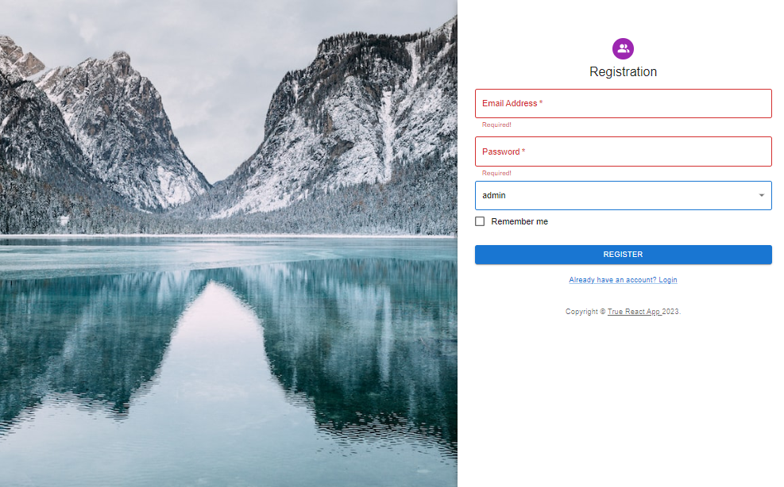
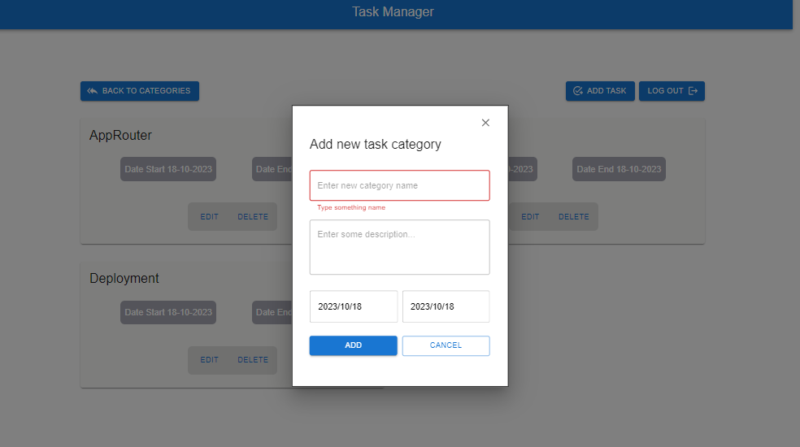
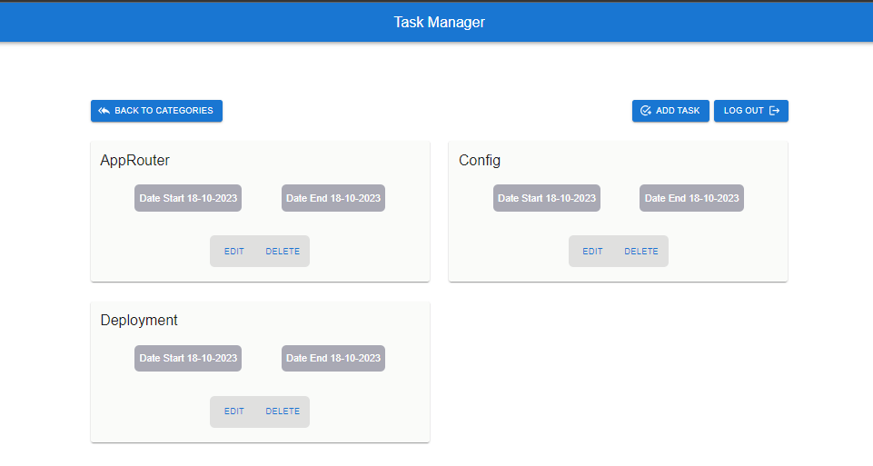
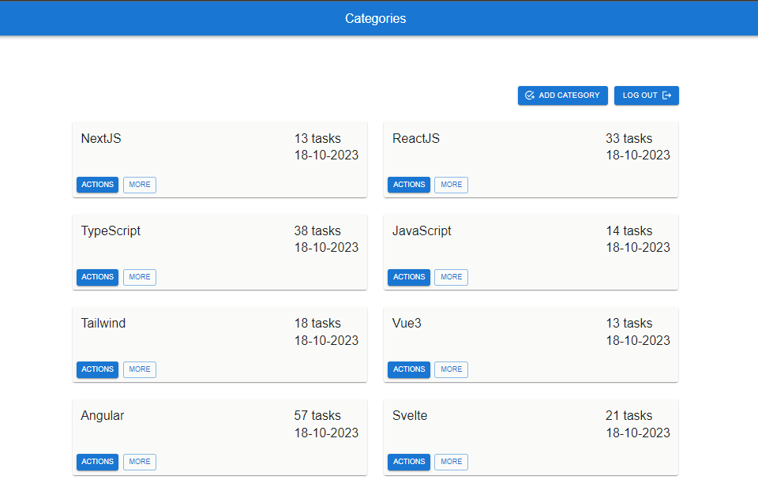

# React NestJS PostgreSQL GraphQL Typeorm Docker 👔

A simple full stack application based on React, Typescript, NestJS, with PostgreSQL as the database, TypeORM is used to manage the database and the backend uses GraphQL as its query language. All of this is packaged in docker-compose

<table width="100%">
  <tr>
    <td align="center" valign="middle" width="17%">
      <a href="https://reactjs.org/">
        
      </a>
      <br />
      React
    </td>
    <td align="center" valign="middle" width="17%">
      <a href="https://www.typescriptlang.org/">
        
      </a>
      <br />
      Typescript
    </td>
    <td align="center" valign="middle" width="17%">
      <a href="https://nestjs.com/">
        
      </a>
      <br />
      NestJS
    </td>
    <td align="center" valign="middle" width="17%">
      <a href="https://www.postgresql.org/">
      
      </a>
      <br />
      PostgresSQL
    </td>
    <td align="center" valign="middle" width="17%">
      <a href="https://graphql.org/">
      
      </a>
      <br />
      GraphQL
    </td>
    <td align="center" valign="middle" width="17%">
      <a href="https://typeorm.io/">
      
      </a>
      <br />
      TypeORM
    </td>
    <td align="center" valign="middle" width="17%">
      <a href="https://www.docker.com/">
      
      </a>
      <br />
      Docker
    </td>
  </tr>
</table>

## Installation and startup method ⚙️ 🔐 ⛏️ 💻

Copy the repository to yourself

```shell
git clone https://github.com/BlackyHat/true-test.git
```

Create an .env file in the root of the repository, for example:

```dotenv
API_PORT=3001
API_HOST=http://localhost:
TYPEORM_CONNECTION=postgres
TYPEORM_USERNAME=admin
TYPEORM_PASSWORD=12#$56
TYPEORM_DATABASE=test
TYPEORM_PORT=5432
TYPEORM_HOST=localhost
JWT_SECRET=hide-me-secret
```

### Using Docker 🏦 🌊 🌀 📙

Make sure you have Docker installed (Docker is not supported by the Windows family of operating systems except
Windows-Professional or Enterprise, as it requires Hyper-V, as stated on the company website Microsoft)
в [documentation](https://docs.microsoft.com/ru-ru/virtualization/hyper-v-on-windows/quick-start/enable-hyper-v#check-requirements)

Execute the command:

```shell
docker-compose up
# -d - to run in the background
# --build - to rebuild the containers
```

##

 
 

##

### Without Docker 🚀 📅 🤠 🔧

- Install PostgreSQL from the official [website](https://www.postgresql.org/)
- Create the server instance and the database, add the user and password as specified in the .env file
- Make sure postgreSQL is up and running
- Perform a dependency installation

### Backend 🖥️ 🚧 ⛏️ 🕔

```shell
cd backend/

# yarn package manager
yarn install
yarn start

# npm package manager
npm install
npm run start
```

### Frontend 🕔 🤠 🪐 📈

```shell
cd frontend/

# yarn package manager
yarn install
yarn start

# npm package manager
npm install
npm run start
```

## The web application using the following technologies and libraries: 💼💼💼

- Typescript
- Node.js
- Nest.js
- GraphQl
- Postgres
- Type ORM
- Docker Compose
- React js
- React hooks
- Apollo
- React Router Dom,

## The project is created using Webpack and also includes: 💼💼💼

- Moment,
- Formik,
- Yup,
- Notifilix,
- React datepicker,
- JWT

## Stay in touch 🧑🏾‍💼 🌆 🏁

- Author - [Oleksandr Podoliako](https://github.com/BlackyHat)
- Linkedin - [http://linkedin.com/in/oleksandr-vp](http://linkedin.com/in/oleksandr-vp)
- Telegram - [@blackhatty](https://t.me/blackhatty)
